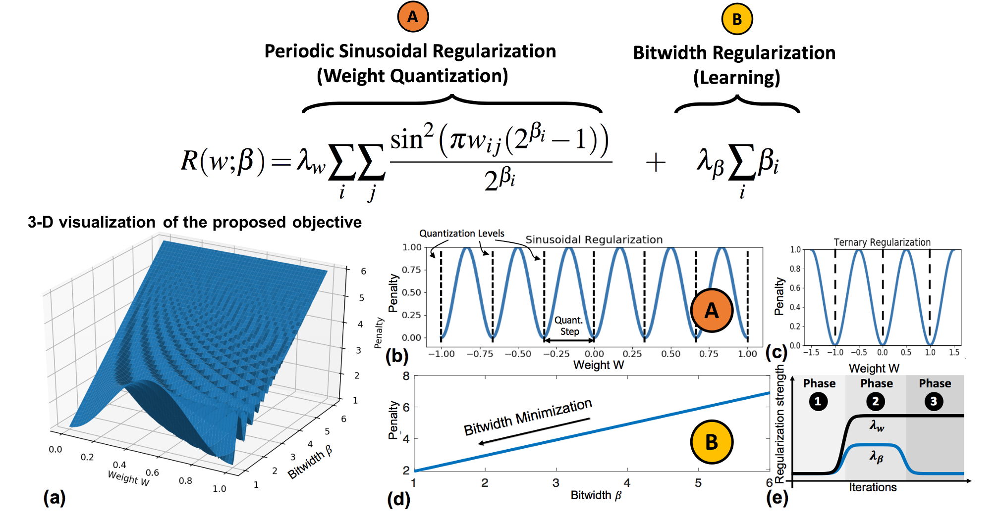

# WaveQ: Gradient-Based Deep Quantization of Neural Networks through Sinusoidal Regularization

## Overview
WaveQ is a sinusoidal-based quantization-aware regularization method. Adding our parametrized sinusoidal regularizer enables us to not only find the quantized weights but also learn the bitwidth of the layers by making the period of the sinusoidal regularizer a trainable parameter. Here, we release the PyTorch implementation for WaveQ.

WaveQ Framework overview:


## Usage
 
### Installation
To install from source and develop locally:

```bash
git clone https://github.com/waveq-reg/waveq.git
cd waveq
pip install --editable .
```

### Training 
run: ./run_MT_train.sh, or:
```
CUDA_VISIBLE_DEVICES=0 fairseq-train \
    data-bin/iwslt14.tokenized.de-en \
    --arch transformer_iwslt_de_en --share-decoder-input-output-embed \
    --restore-file checkpoints/checkpoint_best_ref.pt \
    --optimizer adam --adam-betas '(0.9, 0.98)' --clip-norm 0.0 \
    --lr 5e-4 --lr-scheduler inverse_sqrt --warmup-updates 4000 \
    --dropout 0.3 --weight-decay 0.0001 \
    --criterion label_smoothed_cross_entropy --label-smoothing 0.1 \
    --max-tokens 4096 \
    --eval-bleu \
    --eval-bleu-args '{"beam": 5, "max_len_a": 1.2, "max_len_b": 10}' \
    --eval-bleu-detok moses \
    --eval-bleu-remove-bpe \
    --eval-bleu-print-samples \
    --best-checkpoint-metric bleu --maximize-best-checkpoint-metric \
    --waveq-num_bits_quantize 8 \
    --waveq-lambda_param_q0 2 \
```


### Finetuning
run: ./run_MT_finetune.sh, or:
```
CUDA_VISIBLE_DEVICES=0 fairseq-train \
    data-bin/iwslt14.tokenized.de-en \
    --arch transformer_iwslt_de_en --share-decoder-input-output-embed \
    --restore-file checkpoints/checkpoint_best_ref.pt \
    --optimizer adam --adam-betas '(0.9, 0.98)' --clip-norm 0.0 \
    --lr 5e-4 --lr-scheduler inverse_sqrt --warmup-updates 4000 \
    --dropout 0.3 --weight-decay 0.0001 \
    --criterion label_smoothed_cross_entropy --label-smoothing 0.1 \
    --max-tokens 4096 \
    --eval-bleu \
    --eval-bleu-args '{"beam": 5, "max_len_a": 1.2, "max_len_b": 10}' \
    --eval-bleu-detok moses \
    --eval-bleu-remove-bpe \
    --eval-bleu-print-samples \
    --best-checkpoint-metric bleu --maximize-best-checkpoint-metric
```

### Inference
run: ./run_MT_infer_ckpt.sh; or:
```
START=59 # e.g. start ckpt file of epoch 59
END=75   # e.g. end ckpt file of epoch 75
STEP=1
for i in $(seq $START $STEP $END)
do
  echo "Looping ... i is set to $i" >> infer_BLEU.txt
  fairseq-generate data-bin/iwslt14.tokenized.de-en \
       --path checkpoints/checkpoint$i.pt \
       --batch-size 128 --beam 5 --remove-bpe
done
```

### Visulaize semi-quantized weights after WaveQ regularized training
Given a ckpt file (checkpint.pt), use the following python code snippet to visualize wegiths distrbutions.
```
import torch 
model = torch.load('checkpoint.pt')
w = model['model']['encoder.layers.1.self_attn.k_proj.weight']
w1 = w.data.cpu().numpy().ravel()
n, bins, patches = plt.hist(x=w1, bins='auto')
```

## Acknowledgements
For installtions, follow instructions in https://github.com/pytorch/fairseq/tree/master/examples/translation


